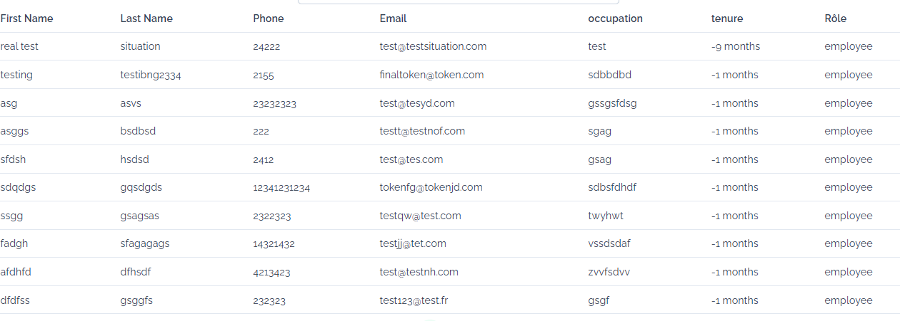
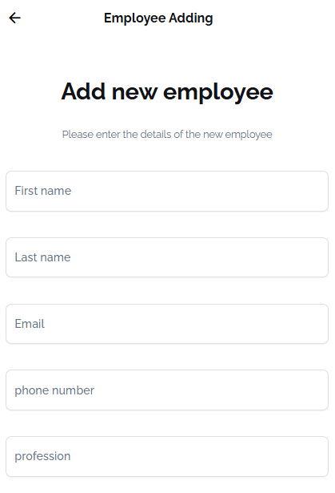

# Enterprise-Angular-Dashboard

# 🖥️ Enterprise Angular Dashboard


> A full-stack enterprise dashboard built with **Angular 17** (frontend) and **Node JS** (backend), featuring authentication and a modular architecture suited for real business use cases.

---


---

## 📸 Screenshots





---

## 🧰 Tech Stack

| Layer | Technology |
|---|---|
| Frontend | Angular 19, TypeScript, SCSS |
| Backend | NodeJS, TypeScript |
| Database | PostgreSQL |
| DevOps | Docker, GitHub Actions CI/CD |

---

## ✨ Features

- 📊 Real-time dashboard with charts and KPI widgets
- 🗂️ Modular Angular architecture (lazy-loaded feature modules)
- 🌐 RESTful API built with NodeJS
- 🐳 Dockerized — frontend + backend + DB run with one command
- ✅ CI/CD pipeline via GitHub Actions

---

## 🏃 Getting Started

### Prerequisites

- Node.js 18+
- Java 17+
- Docker & Docker Compose

### Run with Docker (recommended)

```bash
git clone https://github.com/rigole/Enterprise-Angular-Dashboard.git
cd Enterprise-Angular-Dashboard
./start.sh
```

Then open [http://localhost:4200](http://localhost:4200)

### Run manually

**Backend:**
```bash
cd backend-dashboard
npm run dev
```

**Frontend:**
```bash
cd dashboard-enterprise
npm install
ng serve
```

---

## 🔌 API Endpoints (Sample)

| Method | Endpoint | Description |
|---|---|---|
| POST | `/login` | Authenticate user |
| GET | `/dashboard/stats` | Get dashboard KPIs |
| GET | `/employees` | List all employees |

---

## 🤝 Contributing

Pull requests are welcome! For major changes, please open an issue first to discuss what you'd like to change.

---

## 👤 Author

**Placide Rigole FOLEU**
- GitHub: [@rigole](https://github.com/rigole)
- LinkedIn: [placide-rigole-foleu](https://linkedin.com/in/placide-rigole-foleu)
- Blog: [dev.to/rigole](https://dev.to/rigole)

---

## 📄 License

MIT © Placide Rigole FOLEU